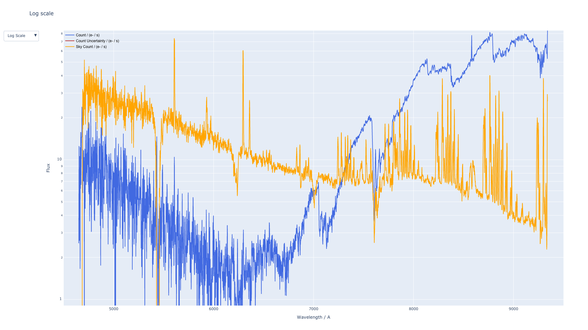

.. _gmosls:

GMOS Longslit
=============

The GMOS Longslit spectrograph is available with both Gemini North and Gemini South. The characteristics of the instruments are very similar, with only some minute differences, at the detector plane. This comment is at least true for the purpose of this quicklook pipeline. The non-negligible differences are taken care of, for example, different sizes of the chip gaps. `See the detailed description of the instuments here <https://www.gemini.edu/instrumentation/current-instruments/gmos>`_.

This quicklook pipeline divides the reduction in two parts - (1) fieldflattening and (2) spectral extraction. The first part takes care of the different binnings, Region Of Interest (ROI), chip gap sizes (North/South are different), bias subtraction, overscan subtraction and response function within chip & across the focal plane. The second part is the spectral extraction.

1. Fieldflattening
------------------
The procedure follows that described on the `US National Gemini Office GMOS cookbook page <http://ast.noao.edu/sites/default/files/GMOS_Cookbook/Processing/masterRef.html>`_ . The `gmos_spectral_extraction.py` keeps the fucntions for performing image reconstruction, generating master bias and global sensitivity function. The only procedure that is not directly obvious from the page is the construction of the response function across the detector array, the steps are as follow:

1. Generate the master flat by dividing the stacked flat by the mean (with sigma clipping and NAN handled).
2. Sum the ADU counts over the few pixels covered by the 2D spectrum in the spatial direction to generate the relative response across the spectral direction.
3. Fit straight lines through the back-to-back end pixels (ignore the last few pixels) of the relative response between the adjacent chips in order to normalise the inter-chip response. See the `linear_fit()` function.
4. Apply the global response function to absolutely normalise the 3-chip image.

In order to reduce the images, the `gmos_reduction.py` should be executed, which makes use of the `gmos_extraction.py` and the parameter YAML file.

The different combinations of available frames will be assignd as one of the following eight scenarios, we require at least one light and one flat frame:

1. Light + Flat
2. Light + Flat + Bias
3. Light + Flat + Arc
4. Light + Flat + Arc + Arc Flat
5. Light + Flat + Arc + Arc Bias
6. Light + Flat + Bias + Arc + Arc Flat
7. Light + Flat + Bias + Arc + Arc Bias
8. Light + Flat + Bias + Arc + Arc Flat + Arc Bias

An example diagnostic pdf:

:pdfembed:`src:../_static/N20181115S0098_diagnostic_plot.pdf, height:1000, width:640, align:middle`

2. Spectral Extraction
----------------------
After the images are flattened and reconstructed, the 'gmos_spetral_extraction.py' can be executed with another YAML parameter file for the spectral extraction configuration. For the purposes of quicklook, most of the parameters can be kept untouched. The paths have to be changed accordingly in order to extract the spectra properly. Mismatched binnings could be handled by automatically up/downsampling the flat/bias frames. However, even when mismatched instruments (North/South) and mismatched gratings can allow the output of a reduced spectrum, the pipeline is not checking all the cases whether the input combination makes sense.

With only Science FITS file
^^^^^^^^^^^^^^^^^^^^^^^^^^^
Extraction will be performed and only the ADU as a function of pixel can be produced.

With only Science and Arc FITS files
^^^^^^^^^^^^^^^^^^^^^^^^^^^^^^^^^^^^
Extraction will be performed and only the ADU as a function of wavelength can be produced.

With only Science, Standard and one of Science or Standard Arc FITS files
^^^^^^^^^^^^^^^^^^^^^^^^^^^^^^^^^^^^^^^^^^^^^^^^^^^^^^^^^^^^^^^^^^^^^^^^^
Extraction will be performed on both the science and standard spectra. The arc will be used for wavelength calibration for both frames. Wavelength and flux will be calibrated.

With Science, Science Arc, Standard and Standard Arc FITS file
^^^^^^^^^^^^^^^^^^^^^^^^^^^^^^^^^^^^^^^^^^^^^^^^^^^^^^^^^^^^^^
Extraction will be performed on both the science and standard spectra. The respective arc will be used for wavelength calibration for the respective frames. Wavelength and flux will be calibrated.

The different combinations of available frames from the fieldflatting will give different sets of final products, they will be one of the following five scenarios:

.. list-table:: Data Product
    :widths: 10 30 60
    :header-rows: 1
    :stub-columns: 1

    * - Case
      - Input
      - Output

    * - 1
      - Science
      - ADU(pix)

    * - 2
      - Science + Arc
      - ADU(wavelength)

    * - 3
      - Science + Arc + Sensitivity Curve
      - Flux(wavelength) from pre-saved sensitivity curve, though it may not provide a good SED, it should be good enough for quick inspection. Need to be careful to select the right combination of grating and central wavelength.

    * - 4
      - Science + Arc + Standard
      - Flux(wavelength) with the potential in getting better absolute flux calibration, if a bad standard is used, the quality will be lower than (3)

    * - 5
      - Science + Arc + Standard + Standard Arc
      - Flux(wavelength) with the potential in getting better absolute flux calibration, if a bad standard is used, the quality will be lower than (3)

* If sensitivity file is provided, (4) & (5) will reduced to (3).
* Without Arc, sensitivity file cannot be used, it will remain as case (1).

An example output html of the extracted spectrum (click for the interactive display in a new tab):

